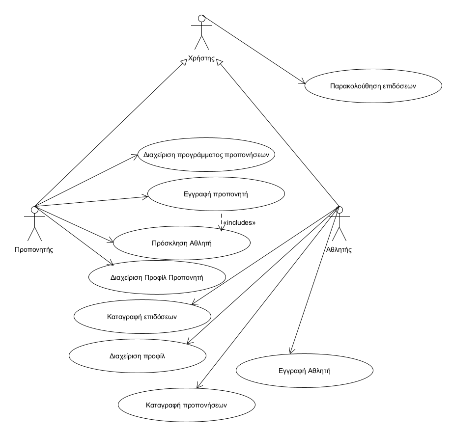
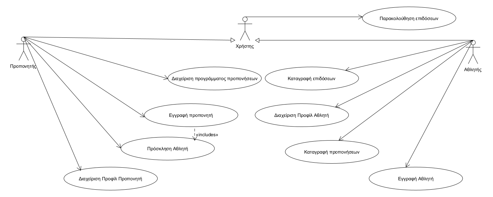
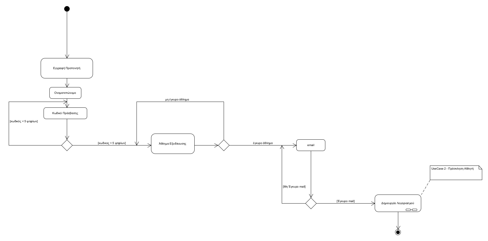
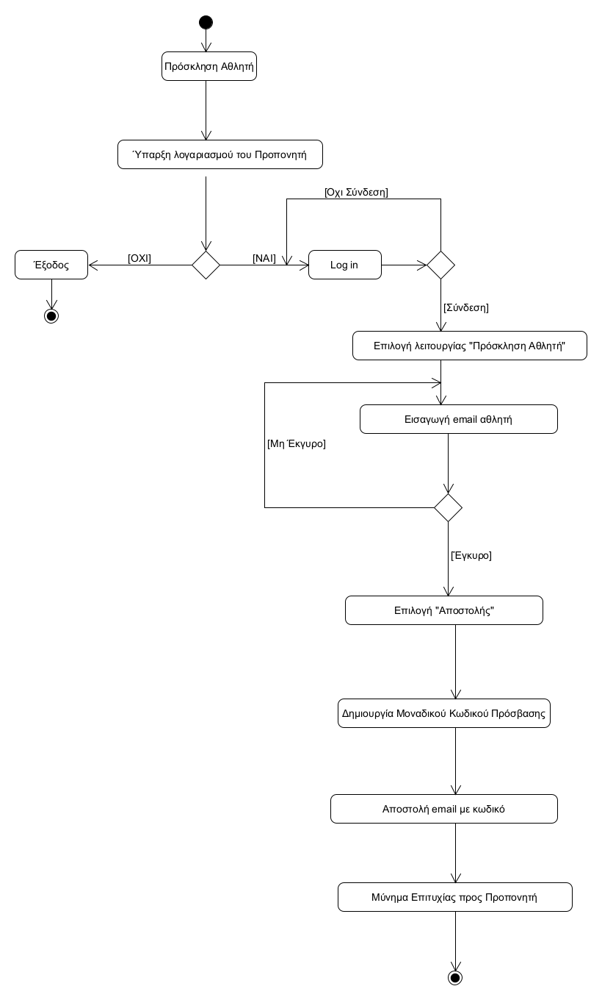
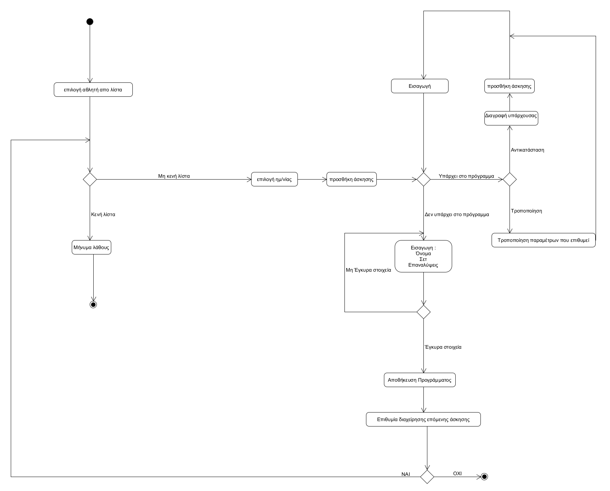
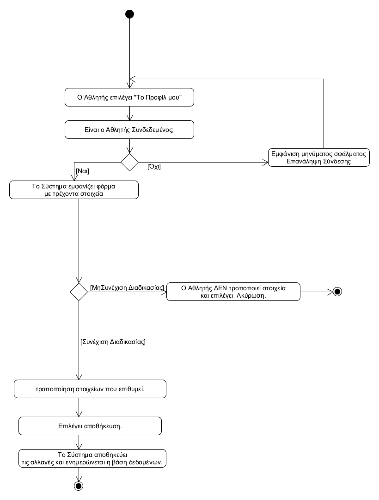
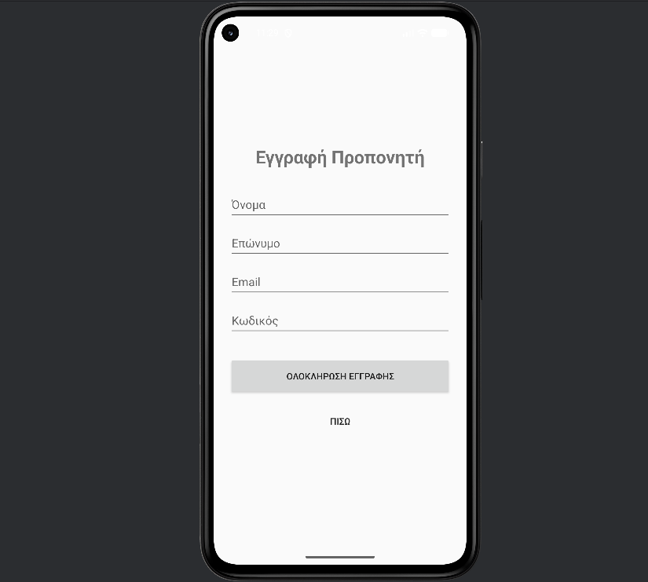

# Διαχείριση Προπονήσεων και Αθλητών Στίβου

## Εισαγωγή & Αρχιτεκτονική Επισκόπηση

## Σχετικά με το Έργο
Η παρούσα εφαρμογή, **"Διαχείριση Προπονήσεων και Αθλητών Στίβου"** (Track 'n Field App), αναπτύχθηκε απο εμένα στο πλαίσιο του μαθήματος **Τεχνολογία Λογισμικού** (ΟΠΑ, 2025-2026). Αποτελεί μια Android εφαρμογή που στοχεύει στην ψηφιοποίηση και οργάνωση της προπονητικής διαδικασίας στον κλασικό αθλητισμό, προσφέροντας εργαλεία τόσο για προπονητές όσο και για αθλητές.

Η ανάπτυξη του λογισμικού ακολούθησε μια **επαναληπτική και επαυξητική διαδικασία** (iterative and incremental development) μέσω τεσσάρων κυκλοφοριών (Releases R1-R4), καλύπτοντας πλήρως τον κύκλο ζωής ανάπτυξης λογισμικού: από την ανάλυση απαιτήσεων και τη σχεδίαση, μέχρι την υλοποίηση και τον έλεγχο.

## Αρχιτεκτονική Σχεδίαση
Η εφαρμογή ακολουθεί αυστηρά το **Αντικειμενοστραφές Μοντέλο** (Object-Oriented Design) και είναι δομημένη με βάση τον διαχωρισμό αρμοδιοτήτων (Separation of Concerns), διακρίνοντας ξεκάθαρα τη λογική του πεδίου από τη διεπαφή χρήστη και την αποθήκευση δεδομένων.

Η αρχιτεκτονική δομή χωρίζεται σε τέσσερα βασικά επίπεδα:

### 1. Επίπεδο Πεδίου (Domain Layer / Entities)
Περιλαμβάνει τις κλάσεις που αντικατοπτρίζουν τις βασικές οντότητες του προβλήματος (`User`, `Athlete`, `Coach`, `Exercise`, `ScheduledTraining`, `Performance`).
* **Σχεδιαστικές Αρχές:** Χρησιμοποιήθηκε **Κληρονομικότητα** (π.χ. `User` ως γονέας των `Athlete`/`Coach`) για την αποφυγή διπλοτυπίας κώδικα και **Σύνθεση** (Composition) για τη συσχέτιση αντικειμένων (π.χ. το Πρόγραμμα "έχει" Προπονήσεις).
* **Ενθυλάκωση:** Όλα τα δεδομένα είναι προστατευμένα (private fields) και προσβάσιμα μόνο μέσω ελεγχόμενων μεθόδων.

### 2. Επίπεδο Λογικής / Ελέγχου (Logic / Controller Layer)
Περιλαμβάνει τους Controllers (π.χ. `ProgramController`, `WorkoutController`) που διαχειρίζονται τη ροή της πληροφορίας και τους επιχειρησιακούς κανόνες. Οι Controllers λειτουργούν ως ενδιάμεσοι, αποσυνδέοντας τα δεδομένα (Entities) από την απεικόνιση (UI).

### 3. Επίπεδο Πρόσβασης Δεδομένων (Data Access Layer - DAOs)
Η διαχείριση της μνήμης και η αποθήκευση των δεδομένων γίνεται μέσω του προτύπου **DAO (Data Access Object)**. Υλοποιήθηκαν συγκεκριμένες κλάσεις (π.χ. `MemoryDAO`) για την προσομοίωση της βάσης δεδομένων στη μνήμη της συσκευής, εξασφαλίζοντας την ανεξαρτησία των δεδομένων από την υπόλοιπη εφαρμογή και διευκολύνοντας τον έλεγχο (testing).

### 4. Επίπεδο Διεπαφής Χρήστη (UI Layer - Android)
Η διεπαφή υλοποιήθηκε με χρήση του **Android Framework** (Activities & XML layouts). Κάθε οθόνη (Activity) επικοινωνεί αποκλειστικά με τους Controllers για την άντληση ή καταχώρηση δεδομένων, χωρίς να περιέχει επιχειρησιακή λογική, ακολουθώντας τις βέλτιστες πρακτικές για την ανάπτυξη σε Android.

## Ποιοτικός Έλεγχος & Εργαλεία
* **Γλώσσα Προγραμματισμού:** Java.
* **Περιβάλλον Ανάπτυξης:** Android Studio.
* **Testing:** Πραγματοποιήθηκαν εκτενείς **Αυτόματοι Έλεγχοι Μονάδας (Unit Tests)** με χρήση **JUnit** για την επιβεβαίωση της ορθής λειτουργίας της λογικής του πεδίου.
* **Code Coverage:** Παράχθηκαν αναφορές κάλυψης κώδικα (Coverage Reports) για την αξιολόγηση της πληρότητας των ελέγχων, εξασφαλίζοντας υψηλά ποσοστά κάλυψης σε Domain, Controllers και DAOs.

---

## R1.1.  Περιγραφή Πεδίου Προβλήματος

Στον χώρο του κλασικού αθλητισμού (στίβου), η συστηματική παρακολούθηση της προόδου και η αυστηρή τήρηση των προγραμμάτων προπόνησης αποτελούν ακρογωνιαίο λίθο για την επιτυχία. Οι προπονητές διαχειρίζονται πολλαπλούς αθλητές, σχεδιάζοντας εξατομικευμένα προγράμματα, ενώ οι αθλητές καλούνται να καταγράφουν με ακρίβεια τις επιδόσεις και την πρόοδό τους. Η διαδικασία αυτή, όταν γίνεται με παραδοσιακές μεθόδους (σημειωματάρια, spreadsheets), είναι συχνά κατακερματισμένη, επιρρεπής σε λάθη και δεν επιτρέπει την εύκολη εξαγωγή στατιστικών συμπερασμάτων.

Η παρούσα εφαρμογή, με την ονομασία "Διαχείριση Προπονήσεων και Αθλητών Στίβου", έρχεται να καλύψει αυτό το κενό. Στόχος της είναι να παρέχει ένα ολοκληρωμένο ψηφιακό περιβάλλον που θα υποστηρίζει τόσο τους προπονητές όσο και τους αθλητές. Μέσω της εφαρμογής, οι προπονητές θα μπορούν να δημιουργούν και να αναθέτουν προγράμματα προπονήσεων, να προσκαλούν τους αθλητές τους στην πλατφόρμα και να παρακολουθούν την απόδοσή τους μέσα από οπτικοποιημένες αναφορές. Αντίστοιχα, οι αθλητές θα έχουν τη δυνατότητα να βλέπουν το πρόγραμμά τους, να καταγράφουν την εκτέλεση των ασκήσεων και τις επίσημες επιδόσεις τους, και να παρακολουθούν την προσωπική τους βελτίωση με την πάροδο του χρόνου.

### Λειτουργίες και Απαιτήσεις:

#### 1. Διαχείριση Προφίλ Προπονητή
*   Προϋπόθεση για τη χρήση της εφαρμογής,τόσο για προπονητές όσο και για αθλητές, είναι η **εγγραφή** και η **επιτυχής ταυτοποίηση** του Προπονητή.

#### 2. Εγγραφή Προπονητή
*   Κατά την εγγραφή, γίνεται καταγραφή των **προσωπικών στοιχείων** και  **αθλήματος/αθλημάτων** στα οποία ειδικεύεται.
*   Ο **Προπονητής:** μπορεί να προσκάλεσει Νέους Αθλητές στους οποίους έρχεται **πρόσκληση εγγραφής** στην εφαρμογή. 

#### 3. Πρόσκληση Αθλητή
*   Ο προπονητής μπορεί να εγγράψει έναν ή περισσότερους αθλητές που προπονεί.
*   Ο αθλητής κάνει εγγραφή στην εφαρμογή **μόνο αφού λάβει πρόσκληση** από τον προπονητή του μέσω email.
*   Η πρόσκληση κοινοποιεί έναν **κατάλληλο κωδικό** στον αθλητή.
*   Ο αθλητής **καταχωρεί** το email και τον κωδικό που έλαβε. Εφόσον η ταύτιση είναι επιτυχής, δημιουργεί λογαριασμό (επιλογή ονόματος χρήστη, κωδικού, καταχωριση προσωπικών στοιχείων).

#### 4. Διαχείριση Προγραμμάτων Προπονήσεων (Από Προπονητή)
*   Κάθε προπονητής δημιουργεί **πρόγραμμα προπονήσεων** για κάθε αθλητή που επιβλέπει.
*   Το πρόγραμμα ορίζει **ημερομηνίες προπονήσεων**, **ασκήσεις** και τον **μέγιστο/ελάχιστο αριθμό επαναλήψεων** ανά άσκηση.

#### 5. Διαχείριση Προφίλ Αθλητή
*   Προϋπόθεση για τη χρήση της εφαρμογής,τόσο για προπονητές όσο και για αθλητές, είναι η **εγγραφή** και η **επιτυχής ταυτοποίηση** του Αθλητή.

#### 6. Καταγραφή Προπονήσεων (Από Αθλητή)
*   Ο αθλητής καταγράφει σε κάθε προπόνηση:
    *   Ποιες ασκήσεις εκτέλεσε.
    *   Τον ακριβή αριθμό επαναλήψεων για κάθε άσκηση.
*   Ο αθλητής καταγράφει επίσης τις **επιδόσεις στο άθλημά του** σε δοκιμαστικούς ή πραγματικούς αγώνες.

#### 7. Καταγραφή Επιδόσεων
*   **Ο Αθλητής:** Μπορεί να βλέπει κάνει αναφορές όσον αφορά τις δικές του επιδόσεις, να γράφει **ακριβές αριθμό επαναλήψεων** που εκτελεί σε καθέ άσκηση/προπόνηση, να συγκρίνει **χρόνους** με προηγούμενες προπονήσεις και έτσι να κρατάει **προσωπικό αρχείο προπονήσεων** το οποίο μπορεί να διαβάζει ανα πάσα στιγμη.

#### 8. Εγγραφή Αθλητή 
* **Ο Αθλητής:** Για να κάνει εγγραφή, πρέπει **απαραίτητα** να έχει λάβει πρόσκληση μέσω email από τον προπονητή του. Αυτή η πρόσκληση περιέχει έναν μοναδικό κωδικό που απαιτείται για την επαλήθευση και την ολοκλήρωση της δημιουργίας λογαριασμού, όπως περιγράφεται αναλυτικά στην Περίπτωση Χρήσης 5.

#### 9. Παρακολούθηση Επιδόσεων
*   **Προπονητής:** Μπορεί να βλέπει αναφορές για:
    *   Την πρόοδο των αθλητών στις διάφορες ασκήσεις (αριθμός επαναλήψεων).
    *   Ποσοστιαία βελτίωση στη μέση επίδοση κάθε αθλητή ανά μήνα.
*   **Αθλητής:** Μπορεί να βλέπει αντίστοιχες αναφορές όσον αφορά τις δικές του επιδόσεις.

## R1.2. Διάγραμμα Περιπτώσεων Χρήσης (Use Case Diagram)

## R2.1.1 Διάγραμμα Περιπτώσεων Χρήσης 

## R2.1.2 **Αναλυτική Περιγραφή Κάθε Περιπτώσης Χρήσης**

## Use Case 1: Εγγραφή Προπονητή
*   **Πρωτεύων actor:** Προπονητής

    **Ενδιαφερόμενοι:** 
    Προπονητής: Του επιτρέπει να  δημιουργεί λογαριασμό στην εφαρμογή.

*   **Προϋποθέσεις:** Ο χρήστης να μην έχει λογαριασμό στο σύστημα με το ίδιο email.

*   **Βασική Ροή :**
    1. Ο χρήστης επιλέγει την "Εγγραφή Προπονητή" από την αρχική οθόνη.
    2. Το σύστημα ζητάει προσωπικά στοιχεία (Ονοματεπώνυμο, email, κωδικό πρόσβασης) και το άθλημα ειδίκευσης.
    3. Ο χρήστης εισάγει τα στοιχεία και πατάει "Εγγραφή".
    4. Το σύστημα ελέγχει την εγκυρότητα των στοιχείων και τη μοναδικότητα του email.
    5. Το σύστημα δημιουργεί τον λογαριασμό και τον συνδέει με τις λειτουργίες της εφαρμογής.
    6. (Συμπερίληψη)Απο τη στιγμή αυτή,του δίνεται η δυνατότητα να προσκαλέσει εναν αθλητή,μεσω της Πρόσκλησης Αθλητή(UC2), **[Πρόσκληση Αθλητή](#3-πρόσκληση-αθλητή)**
* **Εναλλακτικές Ροές:**
    * **4α Ο κωδικός είναι πολύ απλός(έως 5 ψηφία):**
        * Το σύστημα εμφανίζει μύνημα για πιο ισχυρό κωδικό πρόσβασης.
        * Ξαναδίνει κωδικό πρόσβασης
    * **4β. Το email χρησιμοποιείται ήδη:**
        * Το σύστημα εμφανίζει μήνυμα σφάλματος και ζητά νέο email.
        * Ξαναδίνει το email
    * **4γ.Το 'Αθλημα δεν υπάρχει στη βάση δεδομένων-μή έγκυρη εισαγωγή:**
        *Το σύστημα ζητά εκ νέου εισαγωγή αθλήματος

## Use Case 2: Πρόσκληση Αθλητή

*   **Πρωτεύων actor:** Προπονητής

*   **Ενδιαφερόμενοι:**  
    Προπονητης : Επιθυμεί να εγγράψει νέους αθλητές.
    Αθλητής :   Θέλει να μπορεί να δημιουργήσει λογαριασμό στην εφαρμογή.

*   **Προϋποθέσεις:** α. Ο προπονητής να εχει λογαριασμό.

*   **Βασική Ροή:**
    1. Ο προπονητής συνδέεται επιτυχώς στην εφαρμογή
    2. Επιλέγει τη λειτουργία "Πρόσκληση Αθλητή".
    3. Το σύστημα ζητάει το email του αθλητή.
    4. Ο προπονητής εισάγει το email και πατάει "Αποστολή".
    5. Το σύστημα δημιουργεί μοναδικό κωδικό πρόσκλησης.
    6. Το σύστημα αποστέλλει email στον αθλητή με τον  κωδικό.
    7. Εμφανίζεται μήνυμα επιτυχίας στον προπονητή.
* **Εναλλακτικές Ροές:**
    * **1α. Μη υπαρκτός λογαριασμός (Προπονητή):**
        * Το σύστημα τεραμτίζει.
    * **3α. Μη έγκυρο email:**
        * Το σύστημα ενημερώνει ότι η διεύθυνση email που εισήγαγε ο προπονητής, είναι λανθασμένη ή χρησιμοποιείται ήδη 
        * Ο προπονητής ξανα εισάγει το mail του αθλητη.

   

---

## Use Case 3: Διαχείριση Προφίλ Προπονητή
*   **Πρωτεύων actor:** Προπονητής

*   **Ενδιαφερόμενοι:** 
    Αθλητής: θέλει να δημιουργήσει λογαριασμό. 
    Προπονητής: έλει έχει τη δυνατότητα να επεξεργάζεται τα στοιχεία του.

*   **Προϋποθέσεις:** Ο προπονητής να διατηρεί λογαριασμό στην εφαρμογή.

*   **Βασική Ροή:**
    1.Ο προπονητής συνδέεται στην εφαρμογή.
    2.Ο προπονητής επιλέγει "Επεξεργασία Προφίλ".
    3. Το σύστημα εμφανίζει τα τρέχοντα στοιχεία του  : Ονοματεπώνυμο ,email,κωδικός πρόσβασης και άθλημα εξειδικευσης.
    4. Ο προπονητής επιλέγει ποιό στοιχείο θέλει τροποποιήσει(ένα τη φορά).
    5. Το σύστημα επικυρώνει και αποθηκεύει τις αλλαγές.
* **Εναλλακτικές Ροές:**
    
    * **5α. Μη ΄Εγκυρο email**
        *Το σύστημα εμφανίζει σφάλμα ,αν δεν είναι σωστή η μορφή ηλεκτρονικού ταχυδρομίου ή χρησιμοποιείται ήδη.
        *Του εμφανίζεται η επιλογή να ξαναεισάγει καθώς και η δυνατότητα εξόδου.
    * **5β. Μη Έγκυρος κωδικός πρόσβασης.**
        *Το σύστημα εμφανίζει σφάλμα εάν ο κωδικός <5 ψηφίων,οπότε μπορεί να ξαναεισάγει η να αποχωρήσει απο την επεξεργασία.
    * **5γ. Μη Έγκυρο Άθλημα Εξειδίκευσης**
        *Το σύστημα εφόσον δοθεί μη εγκυρο άθλημα ,το οποίο δεν υπάρχει στη βάση δεδομένων,εμφανίζει σφάλμα και δίνει και παλι τις 2 επιλογές,ξανα εισαγωγή νέου αθλήματος ή έξοδος.
 

---

## Use Case 4: Διαχείριση Προγράμματος Προπονήσεων
*   **Πρωτεύων Actor:** Προπονητής

*   **Ενδιαφερόμενοι:** 
    Προπονητής: Δημιουργεί ή επεξεργάζεται το πρόγραμμα προπόνησης ενός αθλητή του.
    Αθλητής: Θέλει να βλέπει το πρόγραμμα. 

*   **Προϋποθέσεις:** Ο προπονητής είναι συνδεδεμένος, έχει τουλάχιστον έναν εγγεγραμμένι αθλητή στη λίστα του και έχει επιλέξει έναν αθλητή.

*   **Βασική Ροή (Σενάριο Επιτυχίας):**
    1. Ο προπονητής επιλέγει έναν αθλητή από την λίστα.
    2. Επιλέγει ημερομηνία στο ημερολόγιο του αθλητή.
    3. Επιλέγει "Προσθήκη Άσκησης".
    4. Εμφανίζεται φόρμα άσκησης για καταχώρηση (όνομα, σετ, επαναλήψεις).
    5. Εισάγει και πατάει προσθήκη.
    6. Επαναλαμβάνει τα βήματα 3-5 για ασκήσεις που επιθυμεί.
    7. Πατάει "Αποθήκευση".
    8. Το σύστημα αποθηκεύει το πρόγραμμα και το καθιστά ορατό στον αθλητή.
*   **Εναλλακτικές Ροές:**
    *   **1α. Η λίστα του προπονητή είναι κενή:**
          * Το σύστημα εμφανίζει μήνυμα λάθους και τερματίζει.
    *   **3α. Υπάρχει ήδη το πρόγραμμα:**
          * Το σύστημα εμφανίζει το πρόγραμμα είτε για τροποποίηση είτε για αντικατάσταση.
          *Αν επιλεγεί τροποποίηση,διαλέγει ποιά απο τις 3 παραμέτρους θέλει να τροποποιήσεις.Μπορει να κανει και τις 3 έαν επιθυμεί.
          *Αν επιλεγεί Αντικατάσταση,διαγράφεται η υπάρχουσα άσκηση ,εμφανίζεται φόρμα άσκησης για συμπλήρωση,και γίνεται προσθήκη.
    *   **5α. Μη έγκυρα στοιχεία:**
        * Εμφανίζει μήνυμα λάθους και επιστρέφει στο βήμα 4.

---

## Use Case 5: Εγγραφή Αθλητή
*   **Πρωτεύων Αctor:** Αθλητής

*   **Ενδιαφερόμενοι:** 
    Αθλητής: Θέλει να δημιουργήσει λογαριασμό.
    Προπονητής: Θέλει να ο αθλητής να αποκτήσει πρόσβαση για να βλέπει την πρόοδο. 

*   **Προϋποθέσεις:** Ο αθλητής έχει λάβει έγκυρο κωδικό πρόσκλησης.

*   **Βασική Ροή (Σενάριο Επιτυχίας):**
    1. Ο αθλητής επιλέγει "Εγγραφή"
    2. Εισάγει τον κωδικό πρόσκλησης και το email του.
    3. Το σύστημα επαληθεύει τον κωδικό.
    4. Ο αθλητής συμπληρώνει τα υπόλοιπα στοιχεία (όνομα, κωδικό πρόσβασης, ημερομηνία γέννησης).
    5. Πατάει "Ολοκλήρωση Εγγραφής".
    6. Το σύστημα δημιουργεί τον λογαριασμό και τον συνδέει με τον προπονητή.
*   **Εναλλακτικές Ροές:**
    *   **2α. Άκυρος/Ληγμένος κωδικός:** Το σύστημα εμφανίζει σφάλμα και ζητά επανεισαγωγή έγκυρου κωδικού.
          * Το σύστημα εμφανίζει σφάλμα   
          * Ζητά εισαγωγή έγκυρου κωδικού

---

## Use Case 6: Διαχείριση Προφίλ Αθλητή (Διαχείριση προφίλ)
*   **Πρωτεύων Αctor:** Αθλητής

*   **Ενδιαφερόμενοι:** 
    Αθλητής: Θέλει να βλεπει και να τροποποιεί τα προσωπικά του στοιχεία.

*   **Προϋποθέσεις:** Ο αθλητής είναι συνδεδεμένος.

*   **Βασική Ροή (Σενάριο Επιτυχίας):**
    1. Ο αθλητής επιλέγει "Το Προφίλ μου".
    2. Το σύστημα εμφανίζει τα τρέχοντα στοιχεία (π.χ. ύψος, βάρος, κωδικός πρόσβασης).
    3. Ο αθλητής τροποποιεί τα στοιχεία που επιθυμεί.
    4. Πατάει "Αποθήκευση".
    5. Το σύστημα επικυρώνει και ενημερώνει τη βάση δεδομένων.
*   **Εναλλακτικές Ροές:**
    *   **3α.Ο αθλητής ΔΕΝ τροποποιεί στοιχεία και επιλέγει ακύρωση**
    

---

## Use Case 7: Καταγραφή Προπονήσεων
*   **Πρωτεύων Αctor:** Αθλητής

*   **Ενδιαφερόμενοι:** 
    Αθλητής: Καταγράφει την εκτέλεση μιας προγραμματισμένης προπόνησης.
    Προπονητής: Παρακολουθεί την πρόοδο του αθλητή.

*   **Προϋποθέσεις:** Ο αθλητής είναι συνδεδεμένος και υπάρχει πρόγραμμα για την τρέχουσα ημέρα.

*   **Βασική Ροή (Σενάριο Επιτυχίας):**
    1. Ο αθλητής επιλέγει/ανοίγει το πρόγραμμα της ημέρας.
    2.Το σύστημα εμφανίζει τη λίστα των προγραμματισμένων ασκήσεων(πχ Άσκηση 1: 1km  σε 20',Ασκηση 2 : 10 σετ απο 10 επαναλύψεις).
    3.Ο αθλητής επιλέγει την άσκηση που επιθυμεί /που ειναι προγραμματισμένη να εκτελέσει.
    4. Το σύστημα εμφανίζει μια φόρμα συμπλήρωσης και καταγραφής εκτέλεσης.
    5.Ο αθλητής εισάγει τα πραγματικά δεδομένα.
    6.Επικυρώνονται απο το σύστημα.
    7. Προσθέτει σχόλια (δυσκολία/εμεπιρία).
    8.Επιλέγει αποθήκευση άσκησης και προχωράει στην επόμενη.
    9. Το σύστημα αποθηκεύει τα δεδομένα της εκτέλεσης.
    10.Αφού ο αθλητής ολοκληρώσει όλες τις ασκήσεις ή όσες καταφέρει,προχωράει στην "Ολοκλήρωση Προπόνησης".
    11.Επιβεβαιώνεται απο το σύστημα,αποθηκεύει τα δεδομένα και ενημερώνει και τον προπονητή.
    12.Εμφανίζεται μήνυμα Επιτυχίας.

*   **Εναλλακτικές Ροές:**
    *   **1α. Δεν υπάρχει πρόγραμμα:** 
          * Το σύστημα ενημερώνει τον αθλητή ότι δεν του έχει ανατεθεί προπόνηση για σήμερα.
        **5α. Ο αθλητής εισάγει αρνητικούς χρόνους**
          * Εμφανίζεται μήνυμα λάθους,και του δίνεται η δυνατότητα να ξανα εισάγει.
        **5β.Ο αθλητής εισάγει αρνητικό αριθμό εκτελέσεων/επαναλύψεων μίας άσκησης**
          *Ομοίως εμφανίζεται μήνυμα λάθους και δυνατότητα εκ νέου εισαγωγής.

---

## Use Case 8: Καταγραφή Επιδόσεων
*   **Πρωτεύων Αctor:** Αθλητής

*   **Ενδιαφερόμενοι:** 
    Αθλητής: Καταγράφει μια επίσημη επίδοση (π.χ. από αγώνα).
    Προπονητής: Βλέπει τα αποτελέσματα για να παρακολουθεί την πρόοδο του αθλητή. 

*   **Προϋποθέσεις:** Ο αθλητής είναι συνδεδεμένος.

*   **Βασική Ροή (Σενάριο Επιτυχίας):**
    1. Ο αθλητής επιλέγει την ενότητα "Επιδόσεις" 
    2.Του εμφανίζεται η αρχική σελίδα Επιδόσεων.
    3. Πατάει "Προσθήκη Νέας Επίδοσης".
    4. Το σύστημα εμφανίζει μια φόρμα καταχώρησης επίδοσης,με πεδία : Ημερομηνία,Άθλημα, Αγώνας/Προνόνηση,Επίδοση.
    5. Συμπληρώνει τα πεδία.
    6.Το σύστημα επικυρώνει τα εισαγόμενα δεδομένα.
    7. Πατάει "Καταχώρηση" ή "Αποθήκευση".
    8. Το σύστημα αποθηκεύει τη νέα επίδοση στο ιστορικό του αθλητή.
    9.Του εμφανίζεται μήνυμα επιτυχίας καταχώρησης.
*   **Εναλλακτικές Ροές:**
    *   **5α. Λάθος μορφή επίδοσης (αρνητικός χρόνος):**
          * Το σύστημα ζητά διόρθωση 
        **5β. Λανθασμένη ημερομηνία (μελλοντική ημερομηνία):**
          *Το σύστημα ζητά διόρθωση με την σημέρινή η πρίν απο την σημερινή ημέρα,ημερομηνία.

---

## Use Case 9: Παρακολούθηση Επιδόσεων
*   **Πρωτεύων Αctor:** Χρήστης (Προπονητής ή Αθλητής)

*   **Ενδιαφερόμενοι:** 
    Αθλητής: Θέλει να βλέπει την συνολική πρόοδο με συγκεντρωτικά στατιστικά και γραφήματα.
    Προπονητής: Θέλει να βλέπει την πρόοδο των αθλητών του και την ποσοστιαία βελτίωση 

*   **Προϋποθέσεις:** Ο χρήστης είναι συνδεδεμένος.

*   **Βασική Ροή (Σενάριο Επιτυχίας):**
    1. Ο χρήστης επιλέγει την ενότητα "Στατιστικά".
    2. Αν είναι προπονητής, το σύστημα του δίνει την δυνατότητα να επιλέξει τον αθλητή που θέλει να εξετάσει.
    3. Ο προπονητής επιλέγει έναν απο τους αθλητές.
    4. Εμφανίζονται απο το σύστημα τα αθλήματα που συμμετέχει ο αθλητής καθώς και η δυνατότητα επιλογής ημερομηνιών ωστε να μπορει να δει ο προπονητής/αθλητής συγκεντρωτικά για καποια χρονική περίοδο και να επιλέξει συγκεκριμένο άθλημα συγκεκριμένης ημερομηνίας. 
    5. Γίνεται η επιλογή αθλήματος.
    6. Το σύστημα εμφανίζει , το άθλημα, ημερομηνία που εκτελέστηκε,αν ήταν σε αγώνα/προπόνηση, καθώς και την επίδοση του αθλητή.
    
*   **Εναλλακτικές Ροές:**
    *   **2α. Αν ο χρήστης είναι αθλητής**
          *Η ροή συνεχίζει απο το 4.(καθώς ειναι ήδη συνδεδεμένος οπότε είναι ήδη στον λογαριασμό του)
    *   **3α. Έλλειψη δεδομένων:** 
          * Αν δεν υπάρχουν καταχωρημένες προπονήσεις/επιδόσεις.
          * Το σύστημα εμφανίζει μήνυμα "Δεν υπάρχουν διαθέσιμα δεδομένα".
    *   **4α. Μη έγκυρη ημερομηνία**
          * Το σύστημα εμφανίζει μήνυμα "Μη έγκυρη ημερομηνία" και ζητάει απο τον χρήστη την εκ νέου επιλογή της.
    

## R2.1.3 

## R2.2
# Συμπληρωματικές Προδιαγραφές για τις Μη Λειτουργικές Απαιτήσεις

Οι μη λειτουργικές απαιτήσεις (non-functional requirements) αφορούν τα **ποιοτικά χαρακτηριστικά** του λογισμικού και περιγράφουν **πώς** πρέπει να λειτουργεί το σύστημα  
Για την εφαρμογή μας , *«Διαχείριση Προπονήσεων και Αθλητών Στίβου»*, διαχωρίζονται στις εξής κατηγορίες : 

##  Διαθεσιμότητα 
- Το σύστημα πρέπει να είναι διαθέσιμο για χρήση **24 ώρες το 24ωρο**.
- Οι διακοπές λειτουργίας να προγραμματίζονται μόνο για σοβαρούς λόγους(πχ συντήρησης) και να ενημερώνονται οι χρήστες εγκαίρως.

##  Απόδοση 
- Ο χρόνος απόκρισης για βασικές λειτουργίες (π.χ. σύνδεση χρήστη, προβολή προγράμματος) δεν πρέπει να υπερβαίνει τα **2 δευτερόλεπτα**.
- Το σύστημα πρέπει να υποστηρίζει τουλάχιστον **100 ταυτόχρονους χρήστες**.

##  Συντηρησιμότητα 
- Ο κώδικας της εφαρμογής να είναι **δομημένος σε αρχεία** (π.χ. διαχείριση χρηστών, προπονήσεων, αναφορών),ωστέ οι ενημερώσεις και οι διορθώσεις να γίνονται **χωρις να επενεργούμε στο κυρίως πρόγραμμα**.
- Η τεκμηρίωση του κώδικα να είναι κατανοητή, ώστε να επιτρέπεται η **εύκολη συντήρηση** από διαφορετικούς προγραμματιστές.

## Μεταφερσιμότητα
- Η εφαρμογή πρέπει να είναι **προσβάσιμη** από διαφορετικά λειτουργικά συστήματα (Windows, macOS, Linux).
- Πρέπει επίσης να λειτουργεί σωστά και σε κινητές συσκευές.

## Ευχρηστία 
- Το περιβάλλον χρήστη να είναι  **απλό και κατανοητό** για προπονητές και αθλητές.
- Οι συχνές ενέργειες (π.χ. καταχώριση προπόνησης, προβολή επίδοσης)θα πρέπει να ολοκληρώνονται  **το πολύ σε τρία βήματα**,προκειμένου να παραμείνουν **απλές**.
- Τα μηνύματα και οι οδηγίες να είναι **στα ελληνικά**(ή να δίνεται η επιλογή της γλώσσας στον χρήστη).

## Ασφάλεια
- Η επικοινωνία χρήστη–εφαρμογής να γίνεται μέσω **ασφαλούς πρωτοκόλλου HTTPS**.
- Η πρόσβαση στην εφαρμογή να ελέγχεται μέσω **ταυτοποίησης**(username & password).

## Αξιοπιστία 
- Σε περίπτωση  διακοπής, η εφαρμογή να **μην χάνει** τις τελευταίες καταχωρήσεις.
- Το σύστημα να υποστηρίζει μια **βάση δεδομένων** και να υπάρχει **μηχανισμός επαναφοράς δεδομένων** .
- Να αποθηκεύει τα δεδομένα του χρήστη **εφόσον αυτός το επιθυμεί**.

## R 2.3.1 - Domain Model

## R 2.3.2 - Sequence Diagrams

### Περιγραφή Sequence Διαγράμματος UC2: Πρόσκληση Αθλητή

Το παραπάνω διάγραμμα ακολουθίας απεικονίζει τη βασική ροή της περίπτωσης χρήσης **Πρόσκληση Αθλητή**. Δείχνει την αλληλεπίδραση όπου ο Προπονητής, μέσω της διεπαφής (Invite_Athlete), δίνει εντολή στον Διαχειριστή Ροής (:Invite_Controller). Ο **Controller** αρχικά επικυρώνει το email του αθλητή. Εάν είναι έγκυρο, δημιουργεί ένα αντικείμενο Πρόσκλησης (:Invitation) και καλεί την Υπηρεσία Email (:Email Service) για να αποστείλει την πρόσκληση με έναν μοναδικό κωδικό.

### Περιγραφή Sequence Διαγράμματος UC4: Διαχείριση Προγράμματος Προπονήσεων

Το παραπάνω διάγραμμα ακολουθίας απεικονίζει τη βασική ροή της περίπτωσης χρήσης "Διαχείριση Προγράμματος Προπονήσεων". Δείχνει την αλληλεπίδραση όπου ο **Προπονητής**, μέσω της διεπαφής (**App**), δίνει εντολή στον **Έλεγχο Προγράμματος** (Controller). Ο Controller ανακτά το πρόγραμμα του **Αθλητή** και, στη συνέχεια, **δημιουργεί** ένα νέο αντικείμενο **Άσκηση Προγράμματος**, το οποίο και **προσθέτει** στο αντικείμενο **Προγραμματισμένη Προπόνηση** της συγκεκριμένης ημέρας.

### Περιγραφή Sequence Διαγράμματος UC5: Εγγραφή Αθλητή

Το παραπάνω διάγραμμα ακολουθίας απεικονίζει τη βασική ροή της περίπτωσης χρήσης **Εγγραφή Αθλητή**. Δείχνει την αλληλεπίδραση όπου ο Αθλητής, μέσω της Φόρμας Εγγραφής, υποβάλλει τον κωδικό πρόσκλησης και το email του. Ο Διαχειριστής Ροής **(:Register_Controller)** επικυρώνει αυτά τα στοιχεία με το Αρχείο Προσκλήσεων. Μετά την επιτυχή επικύρωση και την υποβολή των προσωπικών δεδομένων, ο **Controller** δημιουργεί έναν νέο Λογαριασμό Αθλητή και τον συνδέει με τον λογαριασμό του προπονητή (Coach_Account).

### Περιγραφή Sequence Διαγράμματος UC7: Καταγραφή Προπονήσεων

Το διάγραμμα αυτό περιγράφει το σενάριο "Καταγραφή Προπονήσεων" από την πλευρά του **Αθλητή**. Ο αθλητής, αφού δει τις προγραμματισμένες ασκήσεις της ημέρας (που του παρέχει ο Controller **Καταγραφή Προπονήσεων**), εισάγει τις πραγματικές του επιδόσεις (π.χ., 8 επαναλήψεις). Ο Controller στη συνέχεια **δημιουργεί** ένα νέο αντικείμενο **Ολοκληρωμένη Άσκηση** για να αποθηκεύσει αυτή την επίδοση και το **συσχετίζει** με την αρχική **Άσκηση Προγράμματος**.

### Περιγραφή Sequence Διαγράμματος UC9:

Το παραπάνω διάγραμμα ακολουθίας απεικονίζει τη βασική ροή της περίπτωσης χρήσης **Παρακολούθηση Επιδόσεων**. Δείχνει την αλληλεπίδραση όπου ο Αθλητής (ή Προπονητής), μέσω της διεπαφής (Επίδοση UI) δίνει εντολή στον **Ελεγκτή Επιδόσεων** (Επίδοση Ελεγκτής). Ο Controller ανακτά τα στοιχεία του αθλητή από την Οντότητα Αθλητής και τις επιδόσεις από την Οντότητα Καταγραφή Επίδοσης. Ενημερώνει την διεπαφή για την ανανέωση των στατιστικών με βάση τις νέες επιλογές του χρήστη και εμφανίζει τα νέα δεδομένα.

### R3.1 Διάγραμμα Κλάσεων Σχεδίασης

Μετατροπή Πεδίου σε Κλάσεις

*   **Κληρονομικότητα:** Φτιάξαμε την κλάση User για τα κοινά στοιχεία (Email, Password), ώστε να μην τα γράφουμε διπλά σε Προπονητή και Αθλητή.
*   **Private Πεδία:** Κλειδώσαμε τα δεδομένα (private) για ασφάλεια. Αλλαγές γίνονται μόνο ελεγχόμενα μέσω μεθόδων.
*   **Λίστες (Collections):** Βάλαμε Set στους αθλητές για να μην υπάρχουν διπλοεγγραφές και List στις προπονήσεις για να τηρείται η σειρά.
*   **Διαχωρισμός Άσκησης:** Σπάσαμε την άσκηση στα τρία:
    *   Τι είναι (Τύπος).
    *   Τι πρέπει να γίνει (Στόχος στο Πρόγραμμα).
    *   Τι έγινε τελικά (Ολοκληρωμένη/Log).
*   **Σύνθεση (Composition):** "Δέσαμε" τις προπονήσεις με το πρόγραμμα. Αν διαγραφεί το πρόγραμμα, διαγράφονται αυτόματα και οι μέρες του.
*   **Controllers:** Ξεχωρίσαμε τη "λογική" από τα "δεδομένα". Οι Controllers κάνουν τη δουλειά/ελέγχους, οι Entity κλάσεις απλά κρατάνε την πληροφορία.

*  **Διαγράμματα ακολουθίας:** για την περιγραφή της δυναμικής όψης της λογικής του πεδίου για τις **Σημαντικότερες(UC2,4,5)** Περιπτώσεις Χρήσης.
  

 

### R3.2 Υλοποίηση της λογικής του πεδίου σε Java.

### R3.3 Αυτόματοι Έλεγχοι - JUnit Testing

* Δημιουργήσαμε  κλάσεις ελέγχου για όλες τις κλάσεις,στον φάκελο test, με path [ClassTests](./TracknFieldApp/app/src/test/java/com/example/tracknfieldapp)

### R3.4

* Συνολικό coverage report: [coverage report](TracknFieldApp/coverage%20reports/TracknFieldApp.png)

* Φάκελος με όλες τις αναφορές ανά κλάση: [Coverage Classes Folder](./TracknFieldApp/coverage%20reports)

 ### R4.1

* [Διάγραμμα κλάσεων](R4/4.1/classDiagramm.png)

* Τα διαγράμματα ακολουθίας για : Invitation,ScheduledTraining ,Performance:
* [Invitation](R4/4.1/Invitation_Sequence_Diagram.png)
* [Scheduled_Training](R4/4.1/Scheduled_Training_Sequence_Diagram.png)
* [Performance](R4/4.1/Performance_Sequence_Diagram.png)

### R4.2

Η Δομή του Λογισμικού - Υλοποίηση Εφαρμογής στο Android Studio 

### Προπονητης ###

* [MainActivity](TracknFieldApp/app/src/main/java/com/example/tracknfieldapp/ui/MainActivity.java)

* [WelcomeActivity](TracknFieldApp/app/src/main/java/com/example/tracknfieldapp/ui/WelcomeActivity.java)
* [Activity_welcomeXML](TracknFieldApp/app/src/main/res/layout/activity_welcome.xml)
* 

* [RegisterActivity](TracknFieldApp/app/src/main/java/com/example/tracknfieldapp/ui/RegisterActivity.java)
* [Activity_RegisterXML](TracknFieldApp/app/src/main/res/layout/activity_register.xml)
* 

* [Activity_LoginXML](TracknFieldApp/app/src/main/res/layout/activity_login.xml)
* 

* [CoachActivity](TracknFieldApp/app/src/main/java/com/example/tracknfieldapp/ui/CoachActivity.java)
* [Activity_Coach](TracknFieldApp/app/src/main/res/layout/activity_coach.xml)
* 

* [InviteAthleteActivity](TracknFieldApp/app/src/main/java/com/example/tracknfieldapp/ui/InviteAthleteActivity.java)
* [Activity_InviteAthleteXML](TracknFieldApp/app/src/main/res/layout/activity_invite_athlete.xml)
* 

* [CreateProgramActivity](TracknFieldApp/app/src/main/java/com/example/tracknfieldapp/ui/CreateProgramActivity.java)
* [Activity_CreateProgramXML](TracknFieldApp/app/src/main/res/layout/activity_create_program.xml)
* 

* [AddSessionActivity](TracknFieldApp/app/src/main/java/com/example/tracknfieldapp/ui/AddScheduledTrainingActivity.java) 
* [Activity_AddSessionXML](TracknFieldApp/app/src/main/res/layout/activity_add_scheduled_training.xml)
* 

* [AddExerciseActivity](TracknFieldApp/app/src/main/java/com/example/tracknfieldapp/ui/AddExerciseActivity.java)
* [Activity_AddExerciseXML](TracknFieldApp/app/src/main/res/layout/activity_add_exercise.xml)
* 

* [ProgramDetailsActivity](TracknFieldApp/app/src/main/java/com/example/tracknfieldapp/ui/ProgramDetailsActivity.java)
* [Activity_ProgramDetailsXML](TracknFieldApp/app/src/main/res/layout/activity_program_details.xml)
* 

* [ViewProgramsActivity](TracknFieldApp/app/src/main/java/com/example/tracknfieldapp/ui/ViewProgramsActivity.java)
* [Activity_ViewProgramsXML](TracknFieldApp/app/src/main/res/layout/activity_view_programs.xml)
* 

* [ViewAthletesActivity](TracknFieldApp/app/src/main/java/com/example/tracknfieldapp/ui/ViewAthletesActivity.java)
* 
* 

### Αθλητής ###

* [AthleteWelcome](TracknFieldApp/app/src/main/java/com/example/tracknfieldapp/ui/AthleteWelcomeActivity.java)
* [AthleteWelcomeXML](TracknFieldApp/app/src/main/res/layout/activity_athlete_welcome.xml)
* 

* [AthleteLoginActivity](TracknFieldApp/app/src/main/java/com/example/tracknfieldapp/ui/AthleteLoginActivity.java)
* [AthleteLoginActivityXML](TracknFieldApp/app/src/main/res/layout/activity_athlete_login.xml)
* 

* [AthleteRegisterActivity](TracknFieldApp/app/src/main/java/com/example/tracknfieldapp/ui/AthleteRegisterActivity.java)
* [AthleteRegisterActivity](TracknFieldApp/app/src/main/res/layout/activity_athlete_register.xml)
* 

* [AthleteActivity](TracknFieldApp/app/src/main/java/com/example/tracknfieldapp/ui/AthleteActivity.java)
* [AthleteActivityXML](TracknFieldApp/app/src/main/res/layout/activity_athlete.xml)
* 

* [CompletedExercise](TracknFieldApp/app/src/main/java/com/example/tracknfieldapp/ui/CompletedExercise.java)
* 

* [LogWorkoutActivity](TracknFieldApp/app/src/main/java/com/example/tracknfieldapp/ui/LogWorkoutActivity.java)
* [LogWorkoutActivityXML](TracknFieldApp/app/src/main/res/layout/activity_log_workout.xml)
* 

* [AthleteProgressActivity](TracknFieldApp/app/src/main/java/com/example/tracknfieldapp/ui/AthleteProgressActivity.java)
* [AthleteProgressActivityXML](TracknFieldApp/app/src/main/res/layout/athlete_progress.xml)
* 

### R4.3 TESTS ###
* [AthleteTest](TracknFieldApp/app/src/test/java/com/example/tracknfieldapp/AthleteTest.java)
* [CoachTest](TracknFieldApp/app/src/test/java/com/example/tracknfieldapp/CoachTest.java)
* [CompletedExerciseTest](TracknFieldApp/app/src/test/java/com/example/tracknfieldapp/CompletedExerciseTest.java)
* [ExerciseTest](TracknFieldApp/app/src/test/java/com/example/tracknfieldapp/ExerciseTest.java)
* [ExerciseTypeDAOTest](TracknFieldApp/app/src/test/java/com/example/tracknfieldapp/ExerciseTypeDAOTest.java)
* [InvitationTest](TracknFieldApp/app/src/test/java/com/example/tracknfieldapp/InvitationTest.java)
* [MemoryDAOTest](TracknFieldApp/app/src/test/java/com/example/tracknfieldapp/MemoryDAOTest.java)
* [PerformanceTest](TracknFieldApp/app/src/test/java/com/example/tracknfieldapp/PerformanceTest.java)
* [ProgramControllerTest](TracknFieldApp/app/src/test/java/com/example/tracknfieldapp/ProgramControllerTest.java)
* [ScheduledTrainingTest](TracknFieldApp/app/src/test/java/com/example/tracknfieldapp/ScheduledTrainingTest.java)
* [UserTest](TracknFieldApp/app/src/test/java/com/example/tracknfieldapp/UserTest.java)
* [WorkoutControllerTest](TracknFieldApp/app/src/test/java/com/example/tracknfieldapp/WorkoutControllerTest.java)

* 

### R4.4 Javadoc ###
*  Javadoc Reports : [reports](./TracknFieldApp/app/build/outputs/javadoc)

### R4.5 Αναφορες κάλυψης(Coverage_reports)###
*  Οι αναφορές κάλυψης,όσον αφορά  κλάσεις,αντίστοιχα DAO  και συνολικά για όλες τις κλάσεις tests βρίσκονται στον σύνδεσμο :

*  [coverage_reports](./R4/4.5/coverage%20reports/index.html)
*  [coverage_reports](./R4/4.5/coverage%20reports/jacoco-sessions.html)
*  [coverage_reports](./htmlReport/index.html)
*  [coverage_reports](./htmlReport/index.html)  

* 
* 
* 
* 

### R4.6 αναφορές Ποιοτικών Xαρακτηριστικών του κώδικα μέσω Mετρικών###

*   

